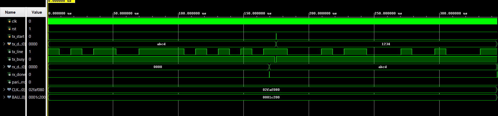
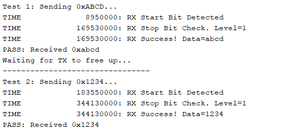

# 16-Bit UART with Even Parity (Verilog)


## 📌 Overview

This project implements a **custom, synthesizable 16-bit UART (Universal Asynchronous Receiver-Transmitter)** using pure Verilog.  
Unlike standard 8-bit implementations, this core is designed for **high-throughput 16-bit data transfer**, making it ideal for FPGA-to-FPGA communication, soft-processor debugging, and precision sensor data acquisition.

The design features **Even Parity** error detection and a highly robust receiver architecture that uses **Double-Flop Synchronization** and **Center-Sampling** to reject noise and metastability.

All simulation waveforms, architectural diagrams, and test results are provided in the **images/** directory.

The module is fully parametric, allowing easy configuration of `CLK_FREQ` and `BAUD_RATE` without hardware dividers.

---

## ✨ Features

### ✔ 16-Bit Architecture
* Transmits full **16-bit integers** in a single frame (Standard UART is 8-bit).
* Frame Format: `Start Bit` + `16 Data Bits` + `Parity Bit` + `Stop Bit`.

### ✔ Robust Receiver (RX)
* **Metastability Hardening:** Uses a **Double-Flip-Flop Synchronizer** on the asynchronous `rx` input.
* **Noise Rejection:** Samples data exactly in the middle of the baud period.
* **Atomic Updates:** Uses an internal "scratchpad" buffer to ensure `rx_data` is only updated once the **entire packet is verified** (prevents output glitches).

### ✔ Error Detection
* **Even Parity:** Automatically generates and checks parity bits.
* **Framing Error:** Validates the presence of the Stop Bit.

---

## 🧠 Hardware Architecture

The UART is implemented as two independent, fully synthesizable modules.

### 📡 Transmitter (`uart_tx.v`)
* **Type:** Finite State Machine (FSM).
* **States:** `IDLE` → `START` → `DATA` (Shift LSB first) → `PARITY` → `STOP`.
* **Logic:** Latches input data on `tx_start` and calculates parity dynamically using XOR reduction.

### 📥 Receiver (`uart_rx.v`)
* **Type:** FSM with Oversampling Counter.
* **Logic:**
    1.  Detects Start Bit (High-to-Low transition).
    2.  Waits `HALF_BAUD` to align with the center of the bit period.
    3.  Shifts bits into a temporary buffer.
    4.  Updates output only if Parity and Stop Bit checks pass.

---

## 🧪 Simulation Results

The project includes a self-checking testbench (`tb.v`) configured for **loopback testing** (TX output connected directly to RX input).

### 📷 Timing Waveform
The simulation verifies the correct transmission of 16-bit words (e.g., `0xABCD` and `0x1234`) with accurate baud timing.



### ✅ Console Output
The testbench verifies data integrity and prints **PASS** confirmation to the TCL console.



---

## 📂 Directory Structure

```text
UART-16bit-Verilog/
│
├── uart_tx.v                 # 16-bit Transmitter with Parity
├── uart_rx.v                 # 16-bit Receiver with Synchronizer
├── tb.v                      # Self-checking Loopback Testbench
│
├── images/                   # Waveforms and Diagrams
│   ├── Timing.png            # Simulation Waveform Result
│   └── Success.png           # TCL Console Pass Log
│
└── README.md                 # Project Documentation
